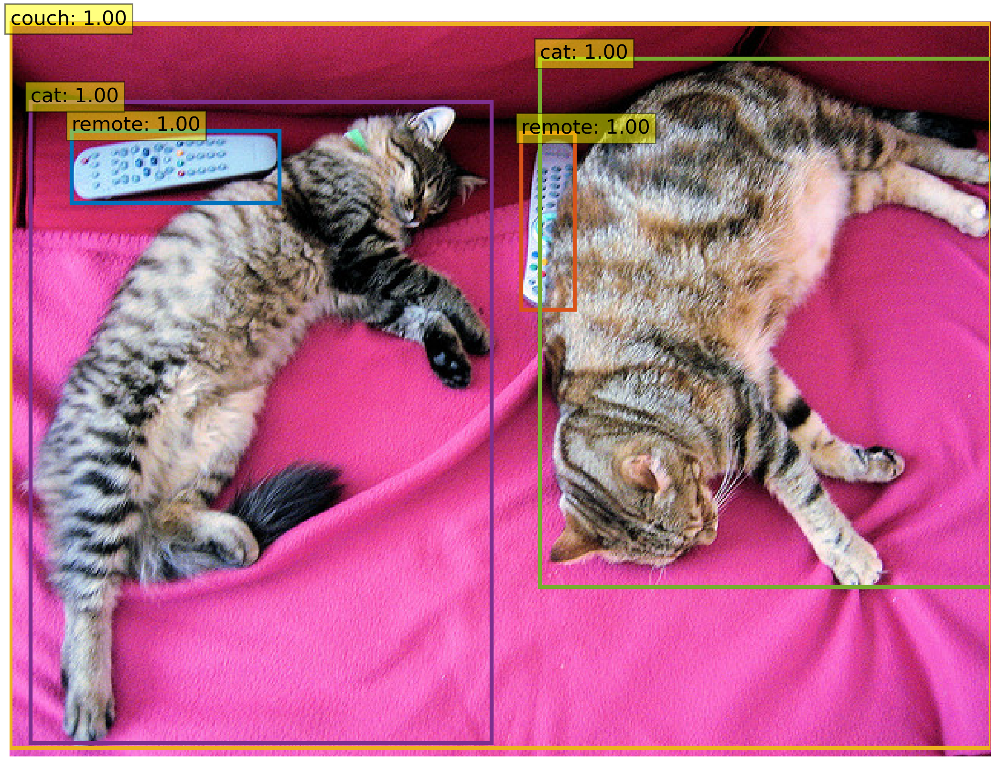
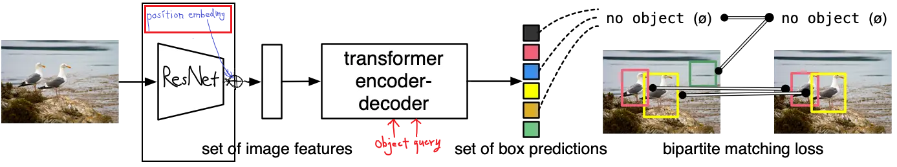
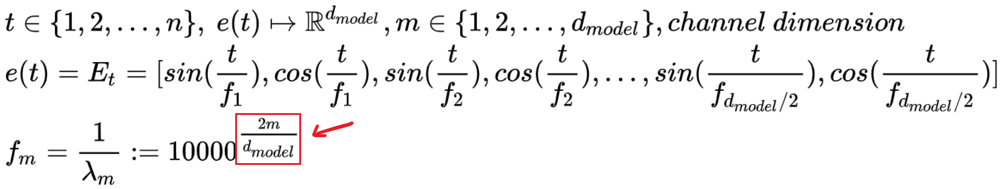
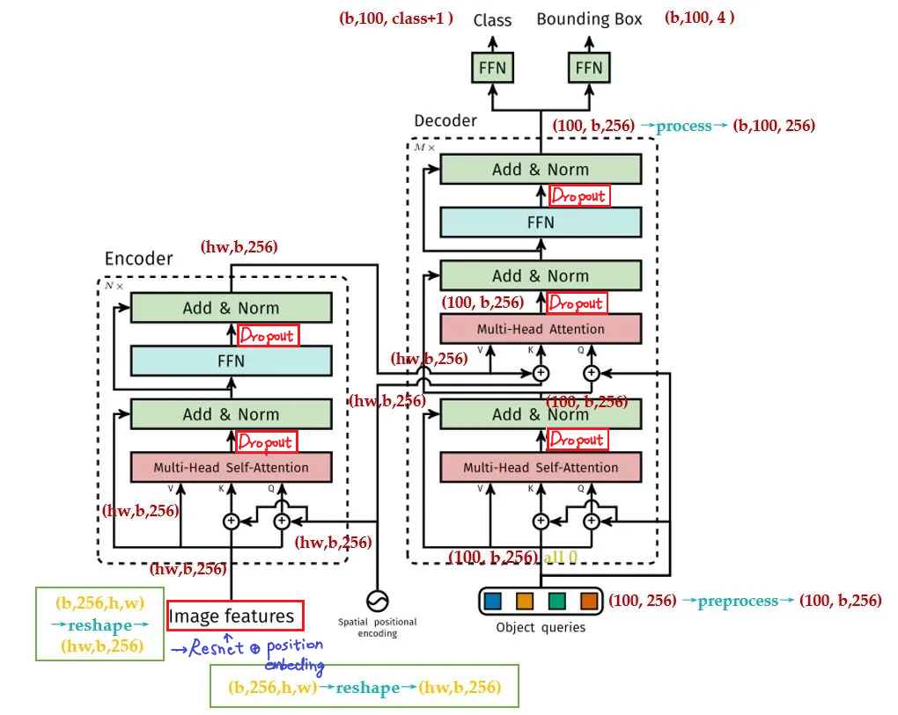
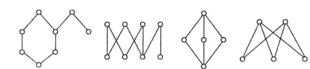
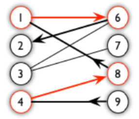
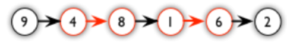
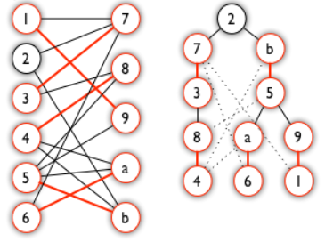

# DETR学习笔记

## DETR 环境配置

DETR: Detection Transformer不需要复杂的依赖库和接口，实现和实验起来非常简单（facebook如是说），
但是也是需要部分依赖的，其原本的requirements的中的

```
git+https://github.com/cocodataset/cocoapi.git#subdirectory=PythonAPI&egg=pycocotools
git+https://github.com/cocodataset/panopticapi.git#egg=panopticapi
```

这两条需要用到git安装，在国内经常出错。先给出两条平替命令：

```
pip install git+https://github.com/philferriere/cocoapi.git#subdirectory=PythonAPI
```

对于下面的panopticapi需要从github上下载源代码，再利用

```
python setup.py build_ext --inplace  
python setup.py build_ext install
```

进行安装. 其余依赖,直接进行安装即可

## 演示demo
下面是脸书的官方示例，方便快捷，易理解。
* [DETR's hands on Colab Notebook](https://colab.research.google.com/github/facebookresearch/detr/blob/colab/notebooks/detr_attention.ipynb): 展示了如何从torch的hub上加载模型（参数已经训练好），产生预测值，即对给定的图片进行目标检测。并且，可视化模型的注意力机制，可以进行交互式的调节。



* [Standalone Colab Notebook](https://colab.research.google.com/github/facebookresearch/detr/blob/colab/notebooks/detr_demo.ipynb): 展示了如何实现一个简化版本的DETR，并对结果进行可视化。如果想更好的理解模型架构与深入解析代码，完全可以从这50行python代码开始。这里面的backbone和transformer是在torchvision中封装好的。
* [Panoptic Colab Notebook](https://colab.research.google.com/github/facebookresearch/detr/blob/colab/notebooks/DETR_panoptic.ipynb):  展示了如何使用DETR进行全景分割并绘制预测的分割结果。


## 如何部署，并训练自己的数据集？

确保已经下载或git好源代码，并安装所需要的所有依赖。

### 准备数据

训练数据的格式为COCO格式，其bbox格式为$ (x_{left}, y_{top}, w, h)$【COCO是一个大规模的对象检测、分割和字幕数据集。COCO有几个特性，有80个对象（事物）类，91个事物类用于字幕、分割、检测等任务。】

数据集文件夹的结构为：

```
└── coco_data

  ├── annnotations
  		└── xxx_train.json
  			xxx_valid.json

  ├── train
  		└── xxx.png(jpg/jpeg)

  └── valid
  		└── xxx.png(jpg/jpeg)

```


### 准备模型训练

点击[这里](https://github.com/facebookresearch/detr)，获取你想要的预训练模型的权重。

<table>
  <thead>
    <tr style="text-align: right;">
      <th></th>
      <th>name</th>
      <th>backbone</th>
      <th>schedule</th>
      <th>inf_time</th>
      <th>box AP</th>
      <th>url</th>
      <th>size</th>
    </tr>
  </thead>
  <tbody>
    <tr>
      <th>0</th>
      <td>DETR</td>
      <td>R50</td>
      <td>500</td>
      <td>0.036</td>
      <td>42.0</td>
      <td><a href="https://dl.fbaipublicfiles.com/detr/detr-r50-e632da11.pth">model</a>&nbsp;|&nbsp;<a href="https://dl.fbaipublicfiles.com/detr/logs/detr-r50_log.txt">logs</a></td>
      <td>159Mb</td>
    </tr>
    <tr>
      <th>1</th>
      <td>DETR-DC5</td>
      <td>R50</td>
      <td>500</td>
      <td>0.083</td>
      <td>43.3</td>
      <td><a href="https://dl.fbaipublicfiles.com/detr/detr-r50-dc5-f0fb7ef5.pth">model</a>&nbsp;|&nbsp;<a href="https://dl.fbaipublicfiles.com/detr/logs/detr-r50-dc5_log.txt">logs</a></td>
      <td>159Mb</td>
    </tr>
    <tr>
      <th>2</th>
      <td>DETR</td>
      <td>R101</td>
      <td>500</td>
      <td>0.050</td>
      <td>43.5</td>
      <td><a href="https://dl.fbaipublicfiles.com/detr/detr-r101-2c7b67e5.pth">model</a>&nbsp;|&nbsp;<a href="https://dl.fbaipublicfiles.com/detr/logs/detr-r101_log.txt">logs</a></td>
      <td>232Mb</td>
    </tr>
    <tr>
      <th>3</th>
      <td>DETR-DC5</td>
      <td>R101</td>
      <td>500</td>
      <td>0.097</td>
      <td>44.9</td>
      <td><a href="https://dl.fbaipublicfiles.com/detr/detr-r101-dc5-a2e86def.pth">model</a>&nbsp;|&nbsp;<a href="https://dl.fbaipublicfiles.com/detr/logs/detr-r101-dc5_log.txt">logs</a></td>
      <td>232Mb</td>
    </tr>
  </tbody>
</table>
模型也可以直接从torch.hub中直接加载，加载backbone为resnet50的的detr代码如下：

```python
model = torch.hub.load('facebookresearch/detr:main', 'detr_resnet50', pretrained=True)
```


COCO panoptic val5k models:
<table>
  <thead>
    <tr style="text-align: right;">
      <th></th>
      <th>name</th>
      <th>backbone</th>
      <th>box AP</th>
      <th>segm AP</th>
      <th>PQ</th>
      <th>url</th>
      <th>size</th>
    </tr>
  </thead>
  <tbody>
    <tr>
      <th>0</th>
      <td>DETR</td>
      <td>R50</td>
      <td>38.8</td>
      <td>31.1</td>
      <td>43.4</td>
      <td><a href="https://dl.fbaipublicfiles.com/detr/detr-r50-panoptic-00ce5173.pth">download</a></td>
      <td>165Mb</td>
    </tr>
    <tr>
      <th>1</th>
      <td>DETR-DC5</td>
      <td>R50</td>
      <td>40.2</td>
      <td>31.9</td>
      <td>44.6</td>
      <td><a href="https://dl.fbaipublicfiles.com/detr/detr-r50-dc5-panoptic-da08f1b1.pth">download</a></td>
      <td>165Mb</td>
    </tr>
    <tr>
      <th>2</th>
      <td>DETR</td>
      <td>R101</td>
      <td>40.1</td>
      <td>33</td>
      <td>45.1</td>
      <td><a href="https://dl.fbaipublicfiles.com/detr/detr-r101-panoptic-40021d53.pth">download</a></td>
      <td>237Mb</td>
    </tr>
  </tbody>
</table>
将权重文件保存到本地后，新建一个python脚本，执行：

```python
import torch
pretrained_weights  = torch.load('detr-r50-e632da11.pth')

num_class = 3  # 数据集的类别数量 + 1
pretrained_weights["model"]["class_embed.weight"].resize_(num_class+1, 256)
pretrained_weights["model"]["class_embed.bias"].resize_(num_class+1)
torch.save(pretrained_weights, "detr-r50_%d.pth"%num_class)
```

得到detr-r50-(类别数).pth权重，并修改源码model中的detr.py文件，找到num_classes指定为 ***需要训练的类别数+1***

在终端运行：

```
python main.py --dataset_file "coco"\
			   --coco_path coco_data \
			   --epochs 100 \
			   --lr=1e-4 \
			   --batch_size=2 \
			   --num_workers=4 \
			   --output_dir="outputs" \
			   --resume="detr-r50_3.pth"

```

或者修改源码的main.py：修改训练的参数（21行--28行）

```python
    parser = argparse.ArgumentParser('Set transformer detector', add_help=False)
    parser.add_argument('--lr', default=1e-4, type=float)
    parser.add_argument('--lr_backbone', default=1e-5, type=float)
    parser.add_argument('--batch_size', default=2, type=int)
    parser.add_argument('--weight_decay', default=1e-4, type=float)
    parser.add_argument('--epochs', default=300, type=int)
    parser.add_argument('--lr_drop', default=200, type=int)
    parser.add_argument('--clip_max_norm', default=0.1, type=float,
                        help='gradient clipping max norm')
```

修改数据集路径：（82行--92行）

```python
    parser.add_argument('--dataset_file', default='coco')
    parser.add_argument('--coco_path', default="你的路径", type=str)
    parser.add_argument('--coco_panoptic_path', default="你的路径", type=str)
    parser.add_argument('--remove_difficult', action='store_true')

    parser.add_argument('--output_dir', default="你的输出路径", default='',
                        help='path where to save, empty for no saving')
    parser.add_argument('--device', default='cuda',
                        help='device to use for training / testing')
    parser.add_argument('--seed', default=42, type=int)
    parser.add_argument('--resume', default='你的权重路径', help='resume from checkpoint')
```

## 模型结构与实现
### 概述



### 位置嵌入

不论哪种位置嵌入方式，都是将原来的图像张量映射到一个更高维的空间中，只是这两种实现的方式有区别，下面是具体的细节。

#### 适用于图像的，基于sine函数的位置嵌入

基于三角函数的位置嵌入方式，需要一个掩码矩阵。

何谓**mask**？**mask**是一个$ [batch\_size, height, width]$大小的张量，为了统一**batch**中的所有图像尺寸，先得到所有维度中最大的尺寸，再对较小的图像进行**padding**，**mask**矩阵就是设置哪些区域是由**padding**得到的，以便模型能够学到有用的知识。

```python
not_mask = ~mask  # 得到的就是那些地方是真实有效的，是真正的图像部分。mask -> [b, h, w]
y_embed = not_mask.cumsum(1, dtype=torch.float32)  # 在列上累加，该列有多少个像素有效
x_embed = not_mask.cumsum(2, dtype=torch.float32)  # 在行上累加，该行有多少个像素有效
if self.normalize:
    eps = 1e-6
    y_embed = y_embed / (y_embed[:, -1:, :] + eps) * self.scale
    x_embed = x_embed / (x_embed[:, :, -1:] + eps) * self.scale  # 0-2*pi

    dim_t = torch.arange(self.num_pos_feats, dtype=torch.float32, device=x.device)
    ...
```

DETR为二维图像在x轴和y轴分别计算了一个位置编码，每个位置编码的长度为num_pos_feats（是backbone输入的一半，因为在后续中会将x和y在拼接在一起）。


使用cunsum函数累加在一起实际上是为了使得行内、列内位置的编码不一样,得到不同周期的三角函数。而得到的$x_{embed}$和$y_{embed}$实际上就是$2\pi$的不同整数倍。

```python
	dim_t = self.temperature ** (2 * (dim_t // 2) / self.num_pos_feats)
```

下面就开始进行位置嵌入：对需要嵌入的$x_{embed}$和$y_{embed}$升维，再利用广播机制$pos_x$和$pos_y$的大小就变为：
$$
[batch\_size, height, width] \rightarrow [batch\_size, height, width, num\_pos\_feats]
$$

```python
    # 在最后一维上进行升维，pos_x, pos_y -> [b, h, w, 1] -> [b, h, w, num_pos_feats]
    # broadcast mechanism
    pos_x = x_embed[:, :, :, None] / dim_t
    pos_y = y_embed[:, :, :, None] / dim_t

    # 正余弦编码，偶数位置sin编码，奇数位置cos编码
    # stack: -> [batch, height, (width, num_pos_feats / 2), 2]
    # flatten: -> [b, h, w, num_pos_feats]
    # cat: -> [b, h, w, num_pos_feats * 2]
    # permute: -> [b, num_pos_feats * 2, h, w]
    # 对于每个位置x y，所在列对应的编码值排在前num_pos_feat维，而行所对应的编码值在后num_pos_feat上
    # 特征图上的各个位置(h * w)都对应到不同的维度，2 * num_pos_feats的编码
    pos_x = torch.stack((pos_x[:, :, :, 0::2].sin(), pos_x[:, :, :, 1::2].cos()), dim=4).flatten(3)
    pos_y = torch.stack((pos_y[:, :, :, 0::2].sin(), pos_y[:, :, :, 1::2].cos()), dim=4).flatten(3)
    pos = torch.cat((pos_y, pos_x), dim=3).permute(0, 3, 1, 2)  # -> [b, 2 * num_pos_feats, h, w]
```
上面主要是与正余弦编码的公式对应：
$$
PE(pos, 2i)=sin(\frac{pos}{10000^{\frac{2i}{dim}}}) \\
PE(pos, 2i+1)=cos(\frac{pos}{10000^{\frac{2i}{dim}}})
$$

偶数位置sin编码，奇数位置cos编码。对于两个不同位置的pos1和pos2，如果在同一维上有相同的编码值，则说明位置的差值是周期的整数倍，而对于另外的维度，周期不同，不同位置在其他维度上编码值不再相等。

对于每个位置x y，所在列对应的编码值排在前num_pos_feat维，而行所对应的编码值在后num_pos_feat上，特征图上的各个位置(h * w)都对应到不同的维度，2 * num_pos_feats的编码。

**但是仍然有些理解不清楚，为什么每个位置的编码都是独一无二的，需要后续进行仔细思考。因为mask后取反为0，累加的值会重复。后续可能有操作进行处理... **

#### 可学习的位置嵌入

这种位置嵌入方式，是将位置编码作为可以在网络中学习的参数，是由torch中的Embedding类实现。

```python
self.row_embed = nn.Embedding(50, num_pos_feats)  # search table
self.col_embed = nn.Embedding(50, num_pos_feats)  # [b, c, h, w]->[..., num_pos_feats]
```

Embedding实际上是一个查找表，类似于hash。这个表的大小为$[50, num\_pos\_feats]$, 生成行列的各个索引之后去，表中查找相应位置的权重，就是位置编码。

```python
def forward(self, x):
    height, width = x.shape[-2:]
    temp_row = torch.arange(width, device=device)  # 每行中的位置索引
    temp_col = torch.arange(height, device=device)  # 每列中的位置索引

    x_embed = self.col_embed(temp_row)  # --> [width, num_pos_feats]
    y_embed = self.row_embed(temp_col)  # --> [height, num_pos_feats]

    # cat: [height, width, num_pos_feats * 2]
    # permute: [num_pos_feats * 2, height, width]
    # unsqeueeze(0): [_, num_pos_feats * 2, height, width]
    # repeat: [batch, num_pos_feats * 2, height, width]
    pos = torch.cat([
        # unsqueeze(0) -> [_, width, num_pos_feats]
        # repeat -> [height, width, num_pos_feats]
        x_embed.unsqueeze(0).repeat(height, 1, 1),
        # unsqueeze(1) -> [height, _, num_pos_feats]
        # repeat -> [height, width, num_pos_feats]
        y_embed.unsqueeze(1).repeat(1, width, 1),
    ], dim=-1).permute(2, 0, 1).unsqueeze(0).repeat(x.shape[0], 1, 1, 1)
```

以x为例：（维度变换代码的注释已经非常详细了）。与上面的不同，对于每个位置x y，所在行对应的编码值排在前num_pos_feat维，而列所对应的编码值在后num_pos_feat上，特征图上的各个位置(h * w)都对应到不同的维度，2 * num_pos_feats的编码。
$$
\begin{bmatrix}
...
\end{bmatrix}_{50\times feats}\\ \underrightarrow{x_{embed},(width)\text{即列的顺序索引}}\ \ 
\begin{bmatrix}
...
\end{bmatrix}_{width\times feats}\\
\underrightarrow{\text{升维并堆叠第一维}}\ \ 
\begin{bmatrix}
...
\end{bmatrix}_{height \times width\times feats}
$$
最终的位置编码的大小为：$[batch, 2\times feats, height, width]$

### backbone

backbone是采用torchvision中的resnet，这部分不是DETR的重点。默认使用的是resnet50，也可以使用其他的CNN模型进行特征提取。最后再将resnet和position embedding连接在一起，但是还是有些细节的地方需要注意！

```python
class Backbone(BackboneBase):
    def __init__(self, name: str,
                 train_backbone: bool,
                 return_interm_layers: bool,
                 dilation: bool):
        backbone = getattr(torchvision.models, name)(
            replace_stride_with_dilation=[False, False, dilation])
            # pretrained=is_main_process(), norm_layer=FrozenBatchNorm2d)
        num_channels = 512 if name in ('resnet18', 'resnet34') else 2048
        super().__init__(backbone, train_backbone, num_channels, return_interm_layers)
```

```python
return_interm_layers: bool
```

这个参数控制的是，是否对骨干网络的每层进行输出。个人感觉设置成False，（存在疑点）当设置为true时，会和默认的Embedding的索引大小冲突，（Embedding默认大小是50*128，但是Resnet第一层输出往往大于50）

### Transformer

Vision Transformer在前一篇文章已经有谈到，encoder的基本信息可以从这里[了解]([Vision-Transformer/vit_study_note/learning_note.md at main · Happy-chicken/Vision-Transformer (github.com)](https://github.com/Happy-chicken/Vision-Transformer/blob/main/vit_study_note/learning_note.md))，但是DETR采用的是encoder和decoder架构.



Transformer主要是有Encoder和Decoder两部分组成，encoder和decoder又分别由几个编码块与解码块堆叠而成。

```python
encoder_layer = TransformerEncoderLayer(d_model, nhead, dim_expands, dropout)
self.encoder = TransformerEncoder(encoder_layer, num_encoder_layers)

decoder_layer = TransformerDecoderLayer(d_model, nhead, dim_expands, dropout)
decoder_norm = nn.LayerNorm(d_model)
self.decoder = TransformerDecoder(decoder_layer, num_decoder_layers, decoder_norm,
                                  return_intermediate=return_intermediate_dec)
```

DETR首先将图像特征拉直成序列，映射到hidden_dim维中

```python
def forward(self, src, mask, query_embed, pos_embed):
    # flatten NxCxHxW to HWxNxC
    
    bs, c, h, w = src.shape  # c == hidden_dim == d_model
    src = src.flatten(2).permute(2, 0, 1) # src = rearrange(src, 'b c h w -> (h w) b c')
    pos_embed = pos_embed.flatten(2).permute(2, 0, 1)  # pos_embed = rearrange(pos_embed, 'b c h w -> (h w) b c')
    query_embed = query_embed.unsqueeze(1).repeat(1, bs, 1)
    mask = mask.flatten(1)
    
    tgt = torch.zeros_like(query_embed)
    memory = self.encoder(src, src_key_padding_mask=mask, pos=pos_embed)
    hs = self.decoder(tgt, memory, memory_key_padding_mask=mask,
                      pos=pos_embed, query_pos=query_embed)
    return hs.transpose(1, 2), memory.permute(1, 2, 0).view(bs, c, h, w)
```

和**ViT**类似，采用一个卷积核进行**patch_embedding**，将图像特征映射到hidden_dim，所以这里的c就是hidden_dim

*src: -> [batch, channel, height, width] -> [(height x width), batch, channel]*

*pos_embed: -> [batch, channel, height, width] -> [(height x width), batch, channel]*

*query_embed: -> [num_query, hidden_dim] -> [num_query, batch, hidden_dim]*

*mask: -> [batch, height, width] -> [batch, (height x width)]* 

这里的height和width都是经过骨干网络提取到的特征图的大小。

#### Encoder

[从此开始]([Vision-Transformer/vit_study_note/learning_note.md at main · Happy-chicken/Vision-Transformer (github.com)](https://github.com/Happy-chicken/Vision-Transformer/blob/main/vit_study_note/learning_note.md))

```python
def forward(self,
            src,
            src_key_padding_mask: Optional[Tensor] = None,
            pos: Optional[Tensor] = None):
    q = k = self.with_pos_embed(src, pos)
    # self.attn返回一个元组，第一个是注意力计算机的结果，即注意力权重的加权和Q，K和V相乘的结果。
    # 第二个元素是注意力的权重，即Q和K相乘的结果。
    src2 = self.self_attn(q, k, value=src, key_padding_mask=src_key_padding_mask)[0]

    src = src + self.dropout1(src2)
    src = self.norm1(src)

    src = src + self.dropout2(self.mlp(src))
    src = self.norm2(src)
    return src

```

之前已经讲过，不论经过多少次transformer的encoder，输出和输入的维度都是一致的，在DETR的transformer中，其输入大小为$[(height\times width), batch, channel]$

```python
src = rearrange(src, 'b c h w -> (h w) b c')
```

从源码中看，首先进行空间位置编码，实际上就是生成一个与输入大小一样的位置嵌入矩阵，逐元素进行相加。注意，仅仅需要对query和key进行操作，而不用对value进行操作，这是因为q和k是计算权重的，而v是加权后的图像特征，各个位置已经有了全局相关性。（**这也是DETR对torch.transformer增加改动的地方之一，另外一处是删除了encoder的最后一个layernorm）**

```python
pos_embed = rearrange(pos_embed, 'b c h w -> (h w) b c')
```

接着进行self-attention计算，这里的参数key_padding_mask，是backbone最后一层输出的特征图的mask，值为true的部分代表图像填充，在注意力计算的过程中会设置成-inf，这样在softmax后，输出就趋向0，可以忽略不计了。而src_mask是常在nlp中使用的，cv领域没有这种“盖住前面输出”的要求。可以不用过分关注。

随后就是经典的归一化与残差连接，再经过一层Mlp，这样将encoder块重复堆叠数次，默认为6次，transformer的encoder就完成了。

```python
class TransformerEncoder(nn.Module):

    def __init__(self, encoder_layer, num_layers):
        super().__init__()
        self.layers = nn.ModuleList([copy.deepcopy(encoder_layer) for _ in range(num_layers)])
        self.num_layers = num_layers

    def forward(self, src,
                src_key_padding_mask: Optional[Tensor] = None,
                pos: Optional[Tensor] = None):
        output = src

        for layer in self.layers:
            output = layer(output, src_key_padding_mask=src_key_padding_mask, pos=pos)

        return output
```


#### Decoder

decoder结构与encoder非常相似。

```python
def forward(self, tgt, memory,
            tgt_key_padding_mask: Optional[Tensor] = None,
            memory_key_padding_mask: Optional[Tensor] = None, # 就是encoder的src_key_masks
            pos: Optional[Tensor] = None,
            query_pos: Optional[Tensor] = None):
    
    q = k = self.with_pos_embed(tgt, query_pos)
    tgt2 = self.self_attn(q, k, value=tgt, key_padding_mask=tgt_key_padding_mask)[0]
    tgt = tgt + self.dropout1(tgt2)
    tgt = self.norm1(tgt)

    tgt2 = self.multihead_attn(query=self.with_pos_embed(tgt, query_pos),
                               key=self.with_pos_embed(memory, pos),
                               value=memory, key_padding_mask=memory_key_padding_mask)[0]
    tgt = tgt + self.dropout2(tgt2)
    tgt = self.norm2(tgt)

    tgt = tgt + self.dropout3(self.mlp(tgt))
    tgt = self.norm3(tgt)
    return tgt
```

从网络的结构图中可以看出:

- tgt就是object query $[num\_queries, batch, hidden\_dim]$，hidden_dim就是从骨干网络输入进来特征图的通道数；

- memory就是encoder部分的输出$[height\times width, batch, hidden\_dim]$

- pos和memory_pos分别是encoder内的位置编码和memory的位置编码，其大小也各与前者一致.

- 第一层的自注意力是object queries内部进行attention计算，与encoder块一样进行空间位置编码

- 第二层的注意力是encoder的输出和object queries进行计算，k和v来自encoder的输出，q来自object queries. 这一层的注意力计算的是目标物体（Q：query）和encoder后图像图像位置特征（K：key）的相关性（？？），再将权值加到encoder的输出（V：value），相当于得到要（关注的）目标物体的特征。

和encoder一样，将多个块堆叠在一起：

```python
class TransformerDecoder(nn.Module):

    def __init__(self, decoder_layer, num_layers, norm=None, return_intermediate=False):
        super().__init__()
        self.layers = nn.ModuleList([copy.deepcopy(decoder_layer) for _ in range(num_layers)])
        self.num_layers = num_layers
        self.norm = norm
        self.return_intermediate = return_intermediate
		
    def forward(self, 
                tgt, 
                memory,
                tgt_key_padding_mask: Optional[Tensor] = None,
                memory_key_padding_mask: Optional[Tensor] = None,
                pos: Optional[Tensor] = None,
                query_pos: Optional[Tensor] = None):
        output = tgt
		"""
        tgt=object query: -> [num_query,batch,hidden_dim], hidden_dim就是从骨干网络输入进来特征图的通道数；
        memory就是encoder部分的输出: -> [height x width, batch, hidden_dim]
        pos: -> encoder内的位置编码 [height x width, batch, hidden_dim]
        memory_pos; -> memory的位置编码 [height x width, batch, hidden_dim]
        memory_key_padding_mask: -> encoder和encoderlayer的src_key_padding_masks
        """
        intermediate = []

        for layer in self.layers:
            output = layer(output, memory,
                           tgt_key_padding_mask=tgt_key_padding_mask,
                           memory_key_padding_mask=memory_key_padding_mask,
                           pos=pos, query_pos=query_pos)
            if self.return_intermediate and self.norm is not None:
                intermediate.append(self.norm(output))  # ！！可能有问题，确保self.norm不为空

        if self.norm is not None:
            output = self.norm(output)

            if self.return_intermediate:
                intermediate.pop()
                intermediate.append(output)

        if self.return_intermediate:
            return torch.stack(intermediate)

        return output.unsqueeze(0)
```

intermediate中记录的是每层输出后归一化的结果，而每一层输入是前一层没归一化的输出！

**第三处改动就是decoder会返回每层的输出，用于进行后续的匹配和计算损失。**

#### Object Query

DETR在decoder部分加入了object query，所谓的object query，类似于anchor，且是一个可以学习的anchor，但是本质上是一个向量，用于在decoder之后生成固定数目（在原本的coco数据集上是100）的目标检测的物体和框。

```python
self.query_embed = nn.Embedding(num_queries, hidden_dim)
```

从实现的技术上看，仍然是一个查找表，其大小为$[100, d\_model(256)]$

但这仅是对一个batch而言，对于所有batch，大小则是$[100, batch, d\_model(256)]$

```python
query_embed = query_embed.unsqueeze(1).repeat(1, batch_size, 1)
tgt = torch.zeros_like(query_embed)
```

并全部初始化为0，这是因为一开始网络还没有输出，query_embed没办法和目标进行计算。

### DETR：Detection Transformer的主体

DTER主体部分就是骨干网络Resnet+位置编码和Transformer的encoder和decoder+输出头，为了有一个更加形象的理解图像维度在整个架构中如何变换，用一个[3, 3, 224, 224]的图像举例，具体而言，batch size=3，宽高=224像素的RGB三通道彩图。

">>"代表输出；"[]"代表类型或者；"->"代表输出的大小；"()"代表函数参数

```markdown
x = [3, 3, 224, 224]
首先经过骨干网络build_backbone()(x)，提取特征图
输出为
>>feature: [list] ->  src: [3, 2048, 14, 14]; mask: [3, 14, 14]
	 其长度由backbone的dilation参数控制(以flase为例)
	 Ture: 每层的特征图与相应的mask
	 False: 仅输出最后一层
	 [3, 3, 224, 224] -> [3, 2048, 14, 14]
>>pos: ->[3, 256, 14, 14]

然后对src: [3, 2048, 14, 14]进行映射
>>projection: [conv2d] (src) -> [3, 256 ,14, 14]
	in_channel: 2048 大小由backbone.num_channel决定，这里是2048
	out_channel: 256 大小由transformwer.d_model决定，这是transformer的一个参数
	[3, 2048, 14, 14] -> [3, 256 ,14, 14]
>>query_embed: [nn.Embedding] -> [100, 256]
     [num_queries, hidden_dim]
     num_queries: 100 由数据集决定，控制最终输出类和框的数目。在coco数据集中，框的数量为100。

>>transformer: (projection, mask, query_embed.weight, pos[-1])
	 下面将深入tranformer内，看数据如何变换
>>flatten (src): -> [3, 256, 196]
>>permute (src): -> [196, 3, 256]
	 src拉直并进行维度变换
	 [3, 256 ,14, 14] -> [3, 256, 196] -> [196, 3, 256]

>>flatten (pos): -> [3, 256, 196]
>>permute (pos): -> [196, 3, 256]
	 pos拉直并进行维度变换
	 [3, 256, 14, 14] -> [3, 256, 196] -> [196, 3, 256]

>>unsqueeze (query_embed): -> [100, 1, 256]
>>repeat (query_embed): -> [100, 3, 256]
	 升维，重复堆叠得到query_pos

>>flatten (mask): -> [3, 196]
	 mask拉直
	 [3, 14, 14] -> [3, 196]
>>encoder: 
>>with_pos_embed: (src, pos)-> [196, 3, 256]
	 逐元素相加
>>self-attention (q, k, v, mask): -> [196, 3, 256]
	 encoder的self-attention中q和v都是src经过位置编码，v就是原本的src特征图
	 attention操作不会改变输入输出的大小
>>FFN/MLP: -> [196, 3, 2048] -> [196, 3, 256]
	 经过一个感知机先是经过中间层放大再回到原来的大小
	 这个放大的维数，是人为规定的，这里是2048
	 这点和ViT一致

>>decoder:
>>tgt=object query: -> [100, 3, 256]
	[num_query,batch,hidden_dim]，初始化为0
    hidden_dim就是从骨干网络经过映射后输入进来特征图的通道数
>>memory: -> [14 x 14, 3, 256]=[196, 3, 256]
 	encoder部分的输出,[height x width, batch, hidden_dim]
>>pos: -> [14 x 14, 3, 256]=[196, 3, 256]
	输入到encoder的位置编码 也就是backbone输出的pos [height x width, batch, hidden_dim], 与memory一致
>>query_pos: -> [100, 3, 256]
	 （在上面已经提到）
	 object query的位置编码 [num_query, batch, hidden_dim], 与tgt一致
以上4行是decoder各个输入参数的大小
>>self-attention: -> [100, 3, 256]
	第一层的自注意力是tgt内部运算
>>multihead-attention: -> [100, 3, 256]
>>mlp: -> [100, 3, 2048] -> [100, 3, 256]
>>unsequeeze: -> [6, 100, 3, 256]
	 由于设置了return_intermediate=True, decoder会返回每层的结果
	 decoder的最终输出第一维就是decoder的数量
>>transformer output: -> 1.[6, 3, 100, 256]; 2.[3, 256, 14, 14]
	 1.decoder的输出，经过一次transpose
	 2.encoder的memory输出
	 >>permute: [196, 3, 256] -> [3, 256, 196]
	 >>view: [3, 256, 196] -> [3, 256, 14, 14]
>>class embed: [Linear] (output[-1]) -> [3, 100, 92]
	 对transformer输出的最后一层进行卷积
	 predict logits shape
	 in_feature:256
	 out_feature:92 = num class + 1
>>box embed: [MLP] -> [3, 100, 4]
	 predict logits shape
	 in_feature:256
	 hidden_dim:256
	 out_feature:4 = 4 -> x_left, y_up, height, width	 
```

```python
if __name__ == "__main__":
    x = NestedTensor(torch.randn(3, 3, 224, 224), torch.randint(0, 2, (3, 224, 224)))
    backbone = build_backbone()
    feat, pos = backbone(x)
    src, mask = feat[-1].decompose()
    print(f"pos shape -> {pos[-1].shape}")
    print(f"src shape -> {src.shape}")
    print(f"mask shape -> {mask.shape}")
    con = torch.nn.Conv2d(2048, 256, kernel_size=1)
    print(f"proj shape -> {con(src).shape}")
    print('--------------------------')
    transformer = build_transformer()
    out = transformer(con(src), mask, torch.nn.Embedding(100, 256).weight, pos[-1])
    print(f"decoder out shape -> {out[0].shape}")
    print(f"encoder out shape -> {out[1].shape}")
    output = model(x)
    print(f"predict logits shape -> {output['pred_logits'].shape}, query class")
    print(f"predict box shape -> {output['pred_boxes'].shape}, 4 represents x_left y_up height width")
```

仅仅是测试代码...

### 集合预测的目标检测

深度学习的目标检测之前有两条路线：一是anchor free方法，有CornerNet等；二是anchor based方法，有one stage的yolo系列算法等和two stage的RCNN。具体内容可看相关论文与博客论坛。但都是特征提取->设置锚点->预测bbox->NMS去重pipeline，DETR提出一种新的范式，即集合预测的目标检测。

对于一个目标框，只会有一个预测框与其匹配，这样，就不需要使用NMS等一些后处理步骤。为了实现一对一的匹配，作者引入了二分图匹配算法。

#### 二部图匹配

##### 什么是二部图？

这是一个数学概念，其数学定义是：若能将无向图$G=<V, E>$的顶点集V划分成两个不相交的非空子集$V_1$和$V_2$，使得G中的任何一条边的两个端点一个属于$V_1$，一个属于$V_2$，这样的图就叫二部图。

判断一个图是不是二部图的方法也很简单：当且仅当图中没有长度为奇数的回路。



##### 什么是匹配？
离散数学中定义，在无向图$G=<V, E>$中，$M \subseteq E$ ，若M中任意两条边不相邻，M为G的匹配。边数最多的匹配称为最大匹配。

**匹配是一个边的集合。**

#### 匈牙利算法

匈牙利算法就是寻找二部图中的最大匹配。注意，无权二部图匹配通常使用的是网络流算法，匈牙利算法处理有权二部图。

DETR直接采用scipy优化模块中的linear_sum_assignment函数直接进行.



交替路：从一个未匹配点出发(右)，依次经过非匹配边、匹配边、非匹配边…形成的路径叫交替路。

增广路：从一个未匹配点出发(右)，走交替路，如果途径另一个未匹配点（除起点外），则这条交替路称为增广路（agumenting path）。



增广路有一个重要特点：非匹配边比匹配边多一条。因此，研究增广路的意义是改进匹配。只要把增广路中的匹配边和非匹配边的身份交换即可。由于中间的匹配节点不存在其他相连的匹配边，所以这样做不会破坏匹配的性质。交换后，图中的匹配边数目比原来多了 1 条。

可以通过不停地找增广路来增加匹配中的匹配边和匹配点。找不到增广路时，达到最大匹配（这是增广路定理).



从二部图可以构造匈牙利树，注意匈牙利树要求所有叶结点均为匹配点。匈牙利算法是用增广路来求最大匹配的算法，在求最大匹配前，需要先用 DFS 或 BFS 找到增广路。

从左边第 1 个点开始，挑选未匹配点进行搜索，寻找增广路
1）若经过一个未匹配点，则寻找成功，更新路径信息，匹配边数 +1，停止搜索。
2）若一直没有找到增广路，则不再从这个点开始搜索。事实上，此时搜索后会形成一棵匈牙利树。我们可以永久性地把它从图中删去，而不影响结果。

由于找到增广路后需要沿着路径更新匹配，因此需要一个结构来记录路径上的点，DFS 版本通过函数调用隐式地使用一个栈，而 BFS 版本使用 pre 数组（前驱结点）。无论DFS还是BFS，时间复杂度都是O(V⋅E)

...这部分属于图论的算法，具体实现的细节可以参考[这里](https://blog.csdn.net/justin666888/article/details/105951210/)

### More

更多可以查询[这里]，对源码进行删减并详细注释。

### 全景分割

...

## Reference

https://ai.meta.com/research/publications/end-to-end-object-detection-with-transformers/
https://towardsdatascience.com/training-detr-on-your-own-dataset-bcee0be05522
https://zhuanlan.zhihu.com/p/647536930
https://www.jianshu.com/p/1d93cde5581a
https://www.jianshu.com/p/c5e95a80fd98
https://blog.csdn.net/justin666888/article/details/105951210/

